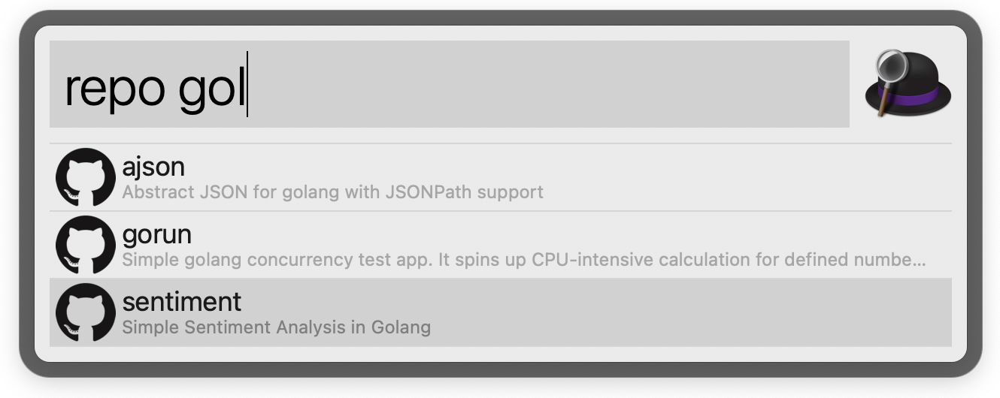
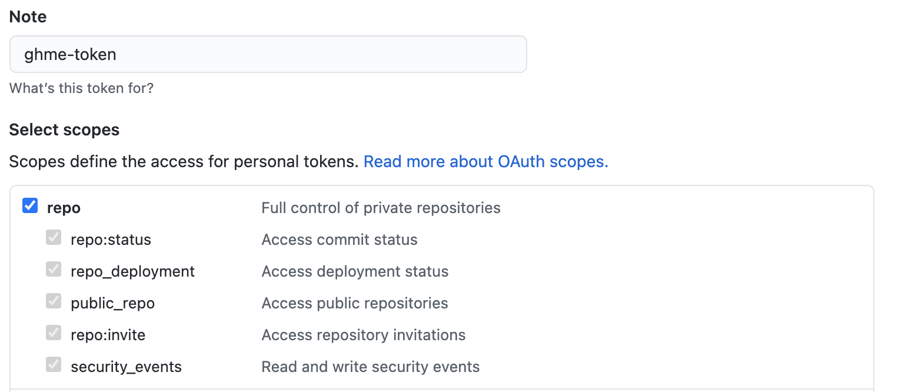
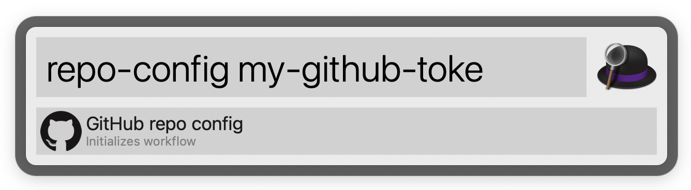
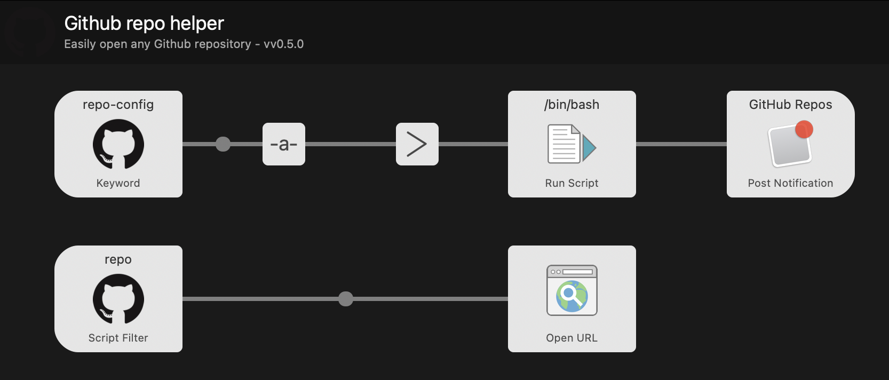

# ghme

Alfred workflow for navigating to repositories. 

## Install 

Download the [latest release of the workflow](https://github.com/mchmarny/ghme/releases/latest) and open it with Alfred.

## Configuration

Create [Personal access tokens](https://github.com/settings/tokens) with sufficient rights to query API for list of all public and private repositories. 

> Check only `public_repo` box if you want to scope your searches to only public directories

Once you have the token, run `repo-config` to enter the token and cache your repos 

> `ghme` does not store your token so to refresh the list of locally cached repos you will have to re-run this step 

## Workflow 

## Disclaimer

This is my personal project and it does not represent my employer. While I do my best to ensure that everything works, I take no responsibility for issues caused by this code.

